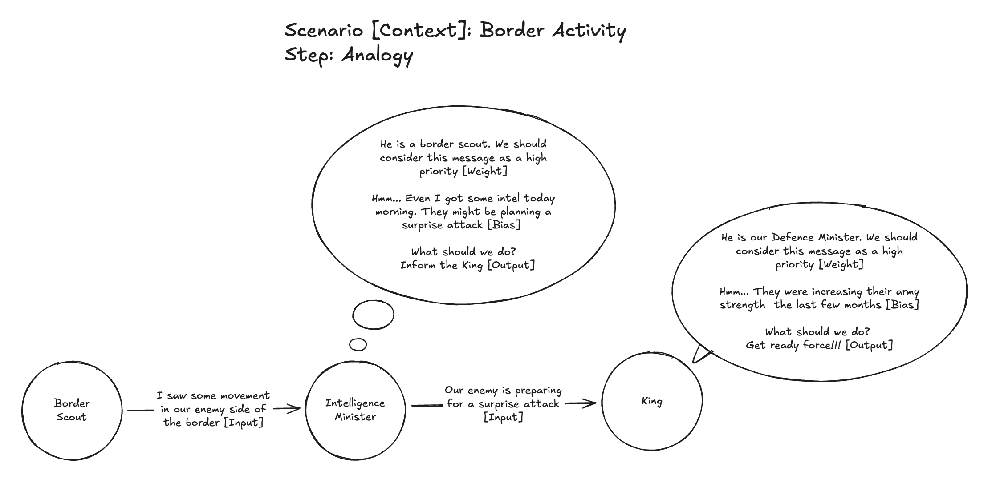
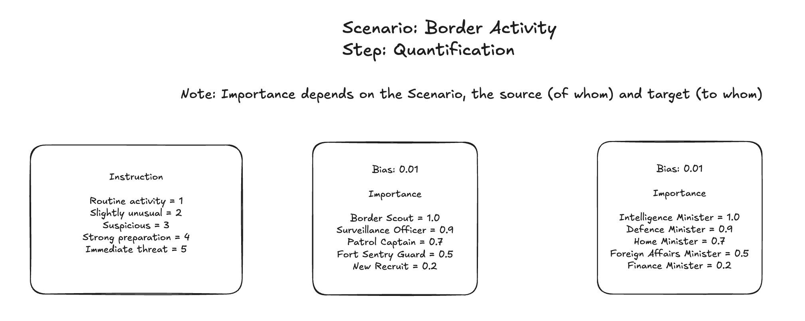
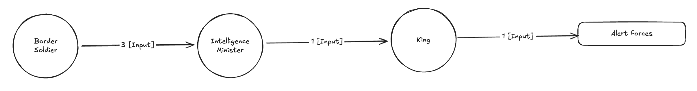

# Lecture 1: The Kingdom

## Introduction

**Thought** is what makes us, humans, different from machines. We are able to make machine help us in calculations but not in thought. Lets take one such thought process here, **Decision Making**.

Thanks to the advancements in statistical mathematics and machine learning algorithms, we are able to approximate to a decision using machine. This might not be 100% correct all the time but helps humans to take best decisions.

## Analogy

We need an intelligent system that decides to alert the forces or ignore the message based on the border activity.

In our scenario, there is a border scout who just watches the activity and informs it to the Intelligence minister. Note, the scout is not a decision maker but just a information passer. The Intelligence minister think, decides if the information has to be passed on to the King. The King later decides if the forces have to be alerted or the message to be ignored.

## Quantification

The scenario have to be quantified with some mathematical values so that it can be used in computation.

### Rules, Importance and Bias

1. **Rules:** The border scout is given a set of rules. The scout should inform the Intelligence minister a number based on the level of activity as shown in the image.
2. **Imoprtance:** The importance given to the input by in the connection between two inputs. Technically it is called weight.
3. **Bias:** Prior knowlege the decision maker has on the context. Practially it is close to 0 or a random value initially. It will get to a value once the network starts learning.
4. **Thought:** This is the core thing that differentiates humans from machines. So, a detailed explanation is done on the [Working Principle](#working-principle) section.

### Quantified Analogy

Below is how the scenario looks like assuming some values based on rules, imprtance and bias.

## Working Principle

1. A network consists of decision makers (nodes) and connection between them.
2. A network receives input from a source and the output of the network is a decision.
3. Each decision maker uses their input, weight and bias to decide what has to be passed to the next decision maker.
4. The **Thought** that each decision maker does is a mathematical function that uses the input, weights and bias and gives output. This thought function is decided by the creator of the network. In this case we are the creators, so we decide the thought function.

## Terminology

1. **Context:** A Scenario for which the neural network is used. Example: Response to border activity
2. **Node/Neuron:** A decision maker in the neural network. Example: King, Intelligence minister
3. **Input:** The information received by a node (decision maker).
   - It can be from another node. Example: input from minister to the king.
   - It can be from something other than a node. Example: input from the scout to minister.
4. **Weight:** The importance given to the input in the connection between two nodes. Example: the importance given to the message from the scout by the minister.
5. **Bias:** The prior knowlege that a node has on the context even before the input is received.
6. **Weighted Input:** Scaled value of the input. Mathematically `Input x Weight`
7. **Activation function:** The thought function of the decision maker. For detailed explanation, check the [Working Principle](#working-principle) section.
